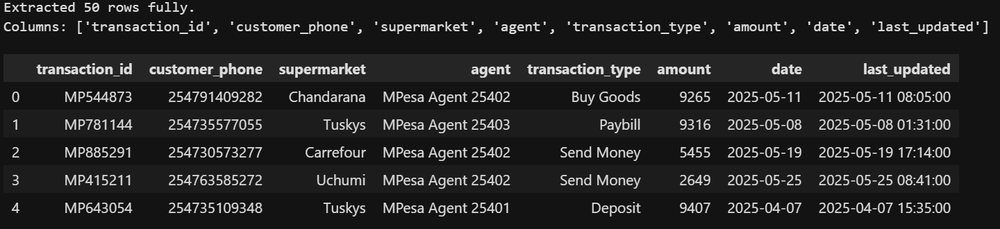
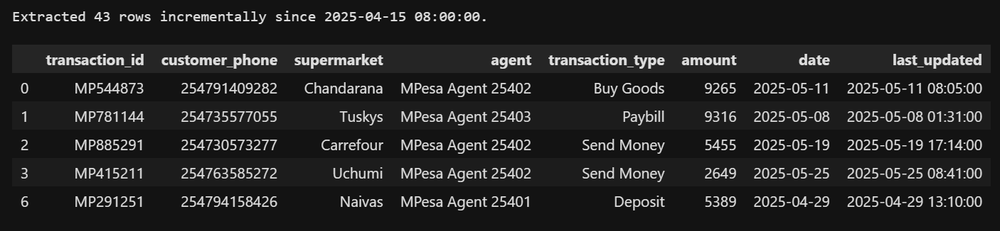
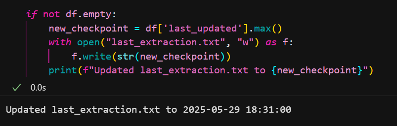
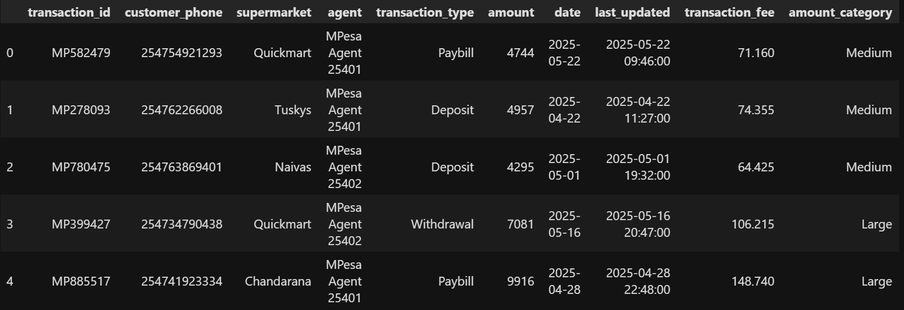
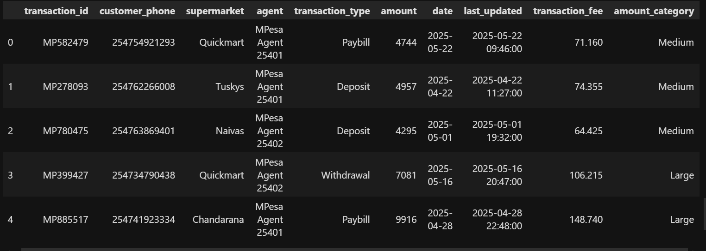

# ETL Lab

**Student:** Faith Mwangi  
**Student ID:** ***954  
**Course:** DSA 2040A  
**Lab:** Extraction in ETL

---

## Project Description

This project demonstrates Full Extraction and Incremental Extraction as part of an ETL (Extract, Transform, Load) process using a realistic Kenyan-based transaction dataset.

## Lab 3: ETL Extract Lab

Generating sample M-Pesa and supermarket sales data, performing full data extraction, tracking extraction timestamps, and extracting only new or updated records incrementally.

## Lab 4: Transform in ETL

This lab extends the ETL pipeline by adding data transformation steps. Transformations applied:
- Removed duplicate transactions for data cleanliness.
- Added a `transaction_fee` column (1.5% of the transaction amount).
- Standardized all date fields to `YYYY-MM-DD` format.
- Categorized transactions as Small, Medium, or Large based on amount.

See `transformed_full.csv` and `transformed_incremental.csv` for outputs.

---

## Tools Used

- **Python 3**
- **pandas**
- **Jupyter Notebook**

---

## File Structure

```
ETL_Extract_FMuthoniMwangi_669954/
├── etl_extract.ipynb        # Main Jupyter notebook
├── custom_data.csv          # Generated Kenyan transaction dataset
├── last_extraction.txt      # Tracks timestamp for incremental extraction
├── .gitignore               # Files to ignore in Git
├── README.md                # Project documentation
```

---

## How to Reproduce

### 1. Clone the Repository

```sh
git clone https://github.com/FMuthoniMwangi/ETL_Extract_FMuthoniMwangi_669954.git
cd ETL_Extract_FMuthoniMwangi_669954
```

### 2. Install Dependencies

Make sure you have Python 3, then install required packages:

```sh
pip install pandas jupyter
```

### 3. Run the Notebook

Start Jupyter Notebook:

```sh
jupyter notebook
```

Open `etl_extract.ipynb` in your browser and follow the step-by-step instructions inside. The notebook will generate `custom_data.csv` and demonstrate both full and incremental extraction.

---

## Data Source

The dataset is generated synthetically using Python, simulating 50 M-Pesa transactions at various Kenyan supermarkets and agents.  
Columns include transaction ID, customer phone, supermarket, agent, transaction type, amount, date, and last updated timestamp.

---

## Screenshots
### Extracting

#### Dataset Preview 


#### Full Extraction


#### Incremental Extraction


#### Timestamp Update

---

### Transforming

#### Full Data


#### Incremental Data 

## License

MIT License.
